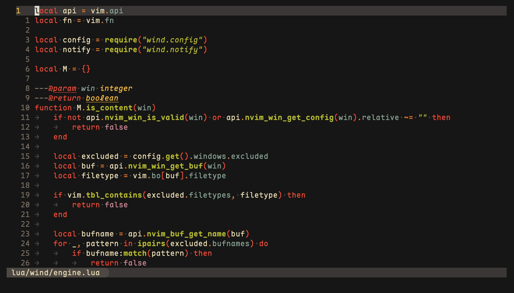

<!-- Header -->
<div align="center">
    <h1>Wind.nvim</h1>
    <p>
        Move as fast as wind
        <br />
        <a href="#about">About</a>
        ·
        <a href="#installation">Installation</a>
        ·
        <a href="#configuration">Configuration</a>
        ·
        <a href="#default-keymaps">Default Keymaps</a>
        ·
        <a href="#breaths">Breaths</a>
        ·
        <a href="#contributing">Contributing</a>
    </p>
</div>

<!-- Demo -->
<div align="center">
    
</div>

## About

Wind.nvim is a Neovim plugin for window management built around destinations.
Every window gets a number based on its position on the screen, and every
operation targets a number: focus it, move to it, swap with it, or close it.

It works by indexing your windows from left to right and then top to bottom
like this example:

    +----------------+  +----------------+  +----------------+
    | Window 1       |  | Window 2       |  | Window 3       |
    | neo-tree       |  | file 1         |  | file 2         |
    | (excluded)     |  | (indexed)      |  | (indexed)      |
    +----------------+  +----------------+  +----------------+
                        index: 1            +----------------+
                                            | Window 4       |
                                            | file 3         |
                                            | (indexed)      |
                                            +----------------+
                                            index: 3

Focusing an index that does not exist creates a new window next to the
current one. Since you will rarely have nine windows, `<leader>9` will
create a new window in most cases.

Wind also records every layout change, so window operations can be undone
and redone. Entire layouts can be held as breaths and returned to later.

Wind.nvim requires Neovim 0.10+.

## Installation

Using [lazy.nvim](https://github.com/folke/lazy.nvim) (recommended):

```lua
{
    "rvaccone/wind.nvim",
    ---@type WindConfig
    opts = {}
}
```

> [!NOTE]
> This is wind.nvim v1, a redesign with breaking changes. Pin
> `version = "v0.1.0"` to stay on the previous design.

## Configuration

Here is the default configuration:

```lua
{
    windows = {
        max = 9,
        flow = { horizontal = "right", vertical = "below" },
        excluded = {
            filetypes = { "neo-tree", "NvimTree", "netrw" },
            bufnames = {},
        },
        notify = true,
    },

    breaths = {
        max = 9,
        auto_hold_first = true,
        persist = true,
        clear_on_start = false,
    },

    reveal = {
        enabled = true,
        delay_ms = 150,
        animate = true,
    },

    keymaps = {
        prefix = "<leader>",
        window = {
            namespace = "w",
            stacked = "v",
            swap = "x",
            close = "q",
            save_close = "z",
            only = "o",
            zoom = "m",
            undo = "u",
            redo = "r",
            equalize = "=",
            grow = "+",
            shrink = "-",
        },
        breath = {
            namespace = "b",
            update = "b",
            hold = "n",
            release = "d",
            clear = "c",
            alternate = "`",
        },
    },
}
```

Use `:h wind` for more information about each configuration option. However,
here are some quick tips:

- Keymaps are a prefix plus single characters. You can disable a keymap by
  setting it to `false`, and `keymaps = false` disables all of them.
- `flow` controls which side new windows appear on. Set
  `horizontal = "left"` for right to left layouts.
- Excluded windows are invisible to wind. They are never indexed, never
  closed, and never captured in breaths. Floating windows are always
  excluded.
- Invalid configuration raises an error on startup instead of guessing.

## Default Keymaps

### Windows

| Keymap                      | Description                        |
| --------------------------- | ---------------------------------- |
| `<leader>1` - `<leader>9`   | Focus or create window 1-9         |
| `<leader>v` + `1-9`         | Focus or create stacked window 1-9 |
| `<leader>w` + `1-9`         | Move the current window to 1-9     |
| `<leader>wx` + `1-9`        | Swap the current window with 1-9   |
| `<leader>q` + `1-9`         | Close window 1-9                   |
| `<leader>z` + `1-9`         | Save and close window 1-9          |
| `<leader>wo`                | Close every other window           |
| `<leader>wm`                | Toggle the zoom lens               |
| `<leader>wu` / `<leader>wr` | Undo / redo layout changes         |
| `<leader>w=`                | Equalize window sizes              |
| `<leader>w+` / `<leader>w-` | Grow / shrink the current window   |

### Breaths

| Keymap              | Description                                    |
| ------------------- | ---------------------------------------------- |
| `<leader>b` + `1-9` | Return to breath 1-9                           |
| `<leader>bb`        | Update the last visited breath                 |
| `<leader>bn`        | Hold a new breath                              |
| `<leader>bd`        | Release the current breath                     |
| `<leader>bc`        | Clear all breaths                              |
| `` <leader>b` ``    | Toggle between the current and previous layout |

All keymaps work in normal and visual modes. Undo, redo, grow, and shrink
support dot repeat, so pressing `.` repeats the last one. Undo and redo also
accept counts: `3<leader>wu` undoes three layout changes.

> [!NOTE]
> Closing a window through wind can never quit Neovim and never discards
> unsaved changes. Window creation behaves the same regardless of your
> `splitright` and `splitbelow` settings.

## Reveal

Press a prefix like `<leader>w` and wait: after a short delay
(`reveal.delay_ms`), a number badge appears on every window. Press a digit
to act, or any other key to cancel. If you type quickly, the badges never
appear.

The same works on `<leader>` itself. Wind never remaps your leader key, it
only watches for it, so plugins like which-key keep working and both can
appear together.

The overlay uses your colorscheme. Every highlight group is a link
(`WindRevealBadge` to `NormalFloat`, `WindRevealBorder` to `FloatBorder`,
`WindRevealCurrent` to `Comment`), so themes and transparent backgrounds
carry through. Override any `WindReveal*` group to restyle.

## Zoom

`<leader>wm` makes the current window fill the screen. While zoomed,
`<leader>1` - `<leader>9` switch which window fills the screen, and
hesitating on `<leader>` shows a list of the windows underneath. Layout
changes are blocked until you exit. Toggling again restores the layout
exactly as you left it.

## Layout history

Wind records every structural change (create, close, move, swap, resize,
and breath returns) in a history per tab. `<leader>wu` undoes and
`<leader>wr` redoes. Layout operations never write, close, or edit a
buffer, so unsaved changes always survive.

## Breaths

A breath is a saved layout. Hold one, change your windows freely, and
return to it later. Returning rebuilds the same splits, files, and cursor
positions around your excluded windows.

- `<leader>bn` holds the current layout as the next breath.
- `<leader>b1` - `<leader>b9` return to a breath. Returning to a number
  that is not held saves the current layout as the next breath instead.
- `<leader>bb` updates the last visited breath to match the current layout.
- `<leader>bd` releases the current breath. Numbers shift down, and the
  last remaining breath cannot be released.
- `<leader>bc` clears all breaths and holds the current layout as breath 1,
  the same state a fresh session starts in.
- `` <leader>b` `` toggles between the current layout and the previous one.
- Hesitating on `<leader>b` shows a card with one column per breath: the
  number on top and each window's file below it.

Breaths persist per project. They are saved on every change and loaded the
next time you open Neovim in the same directory, so opening a project
brings back its layouts. Nothing is applied automatically: loaded breaths
are available, not restored. Set `persist = false` to keep breaths in
memory only, or `clear_on_start = true` to begin every session with a
clean slate.

Breath 1 is held automatically when Neovim starts (skipped when persisted
breaths load). Breaths record file paths instead of buffer handles, so
they restore correctly even after buffers close.

## Statusline

`require("wind").lualine_index()` returns the index of the window being
drawn, for both active and inactive windows. Example for lualine:

```lua
local function wind_index()
    local ok, wind = pcall(require, "wind")
    return ok and wind.lualine_index() or ""
end

require("lualine").setup({
    sections = { lualine_a = { wind_index } },
    inactive_sections = { lualine_a = { wind_index } },
})
```

## Commands

`:Wind reveal`, `:Wind breaths`, `:Wind history`, `:Wind release <n>`,
`:Wind clear`, and `:checkhealth wind`.

See [DESIGN.md](DESIGN.md) for the design principles behind the plugin.

## Contributing

```sh
make test       # run the test suite
make fmt-check  # check formatting with stylua
```
